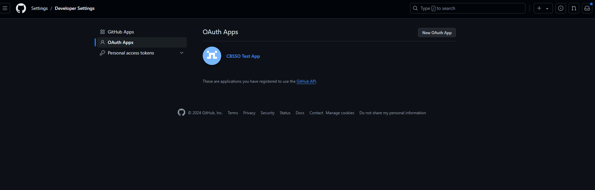

# Quick Start

The busy developer's guide to getting up and running in no time.

Suppose we wanted to add GitHub as a SSO provider to our application located at `myssoapp.com`

### Register app with GitHub

Navigate to [https://github.com/settings/developers](https://github.com/settings/developers).

<figure><figcaption></figcaption></figure>

Click the "New OAuth App" button to bring up the following form.\


<figure><figcaption></figcaption></figure>


The default callback URL will be /cbsso/auth/:providerName. If you set a name for your provider it will be used in the URL. If your provider name is "foo" your URL for that provider workflow will be "https://myssoapp.com/cbsso/auth/foo"


Notice that the authorization callback URL is often case sensitive!


### Gather Client Credentials

Once your app is registered you will see a screen with your client credentials. You need to get the provided client ID as well as generate a new client secret. Make sure you save it! Many systems do not allow you see the secret after it is first generated!

<figure><figcaption></figcaption></figure>

### Configure cbSSO Module Settings

This can be configured in either your `ColdBox.cfc` or in `config/modules/cbSSO.cfc`

```cfscript
moduleSettings = {
  "cbsso" : {
    "providers" : [
      {
	type: "GitHubProvider@cbsso",
	clientId: getJavaSystem().getProperty( "GITHUB_CLIENT_ID" ),
	clientSecret: getJavaSystem().getProperty( "GITHUB_CLIENT_SECRET" )
      }
    ]
  }
};
```

### Implement CBSSOAuthorization Event

Now that our app is registered with GitHub and our client credentials have been configured in our module settings we need to handle the event. This is done through an interception point.

```cfscript
public void function CBSSOAuthorization( event, data ){
    // the provider that was used for SSO
    var provider = data.provider;
    // an instance of ISSOAuthorizationResponse that contains our data
    var ssoAuthorizationResponse = data.ssoAuthorizationResponse;
    
    if( !ssoAuthorizationResponse.wasSuccessful() ){
        logger.error( "Failed SSO workflow: #ssoAuthorizationResponse.getErrorMessage()#" );
        relocate( "/login" );
    }
    
    var user = UserService.findByEmail( ssoAuthorizationResponse.getEmail() );
    
    // check if we have a user record for this person already
    if( isNull( user ) ){
        user = UserService.new();
        
        user.setEmail( ssoAuthorizationResponse.getEmail() );
        user.setFirstName( ssoAuthorizationResponse.getFirstName() );
        user.setLastName( ssoAuthorizationResponse.getLastName() );
        
        user.save();
    }
    
    // log them in - YAY SSO!
    user.login();
    
    relocate( "/dashboard" );
} 
```

### Render SSO Options to User

The final step is to prevent our SSO options to a user.

```html
<!-- in views/login.cfm -->
<cfoutput>
    <cfscript>
        providerOptions = getInstance( "ProviderService@cbsso" ).getProviderOptions();
    </cfscript>
    <form action="/login">
        <h2>Login</h2>
        <input name="username" type="text" /> 
        <input name="password" type="password" /> 
        <button type="submit">Submit</button>
    </form>
    <p>-- or --</p>
    <div>
      <!-- Loop through our providers and use the provided URL to start SSO -->
      <cfloop array="#providerOptions#" index="option" />
          <a class="link-button" href="#option.url#">Continue with #option.name#</a>
      </cfloop>  
    </div>
</cfoutput>
```
